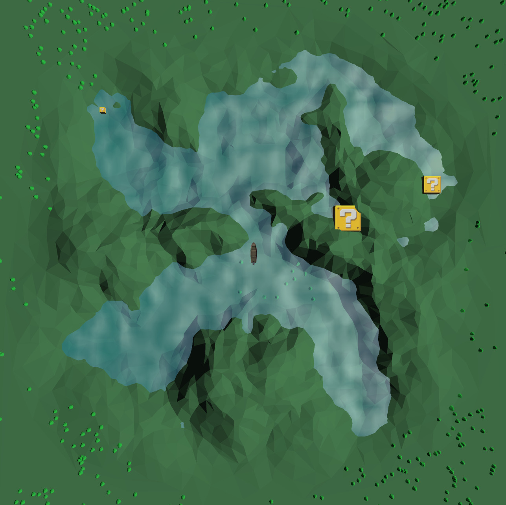
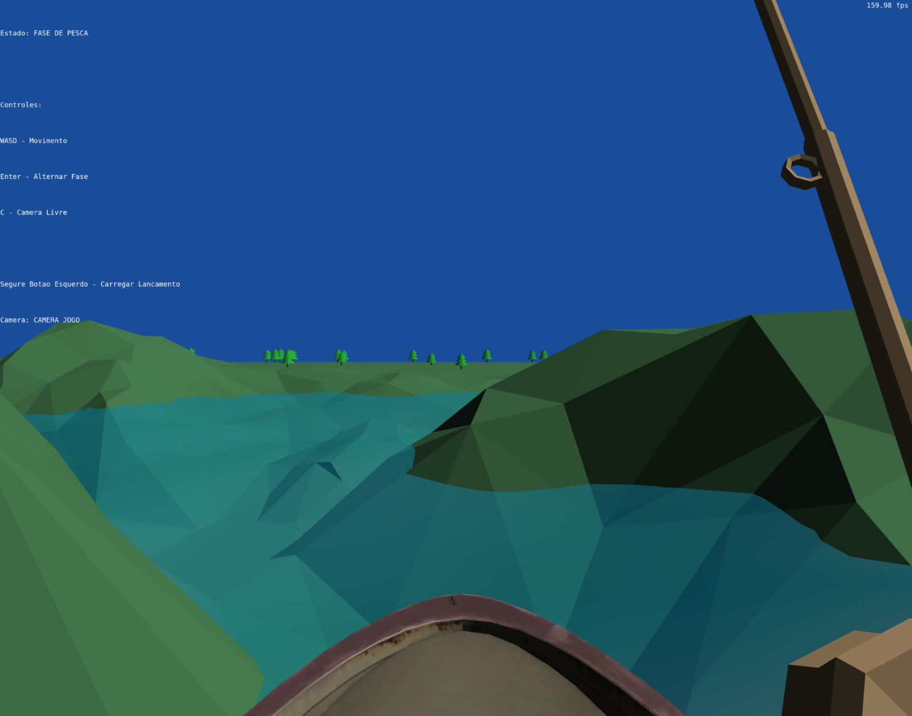

# Carpa Diem

Carpa Diem é um jogo de pesca 3D simples e relaxante escrito em C++ usando OpenGL.


*Fase de Navegação - Vista top-down do lago*


*Fase de Pesca - Vista em primeira pessoa*

## Contribuições

**Bernardo**: Implementação da mecânica da vara de pesca e integração de features extras desenvolvidas em outras branches.

**Guillermo**: Desenvolvimento do sistema de água, modelos de iluminação (Lambert, Blinn-Phong, Gouraud) e mecânica de lançamento da isca.

**Luca**: Implementação da movimentação dos peixes (curvas de Bézier), criação do grid de áreas válidas do mapa e construção da topologia do cenário.

## Uso de Ferramentas de IA

Utilizamos ferramentas de IA principalmente para auxiliar no processo de debugging e nas tentativas de implementação da colisão entre o mapa e o barco. As ferramentas foram úteis para identificar erros de lógica e sugerir abordagens alternativas durante o desenvolvimento.

## Processo de Desenvolvimento

### Conceitos de Computação Gráfica Implementados

#### 1. Transformações Geométricas
- **Matrizes Model, View e Projection**: Utilizamos o pipeline completo de transformações para posicionar objetos na cena, definir a câmera e aplicar projeção perspectiva.
- **Composição de transformações**: O barco, vara de pesca e outros objetos utilizam múltiplas transformações encadeadas (translação, rotação, escala).

#### 2. Sistemas de Câmera
- **Câmera Look-At (Top-Down)**: Na fase de navegação, utilizamos uma câmera posicionada acima do cenário, olhando para baixo.
- **Câmera Primeira Pessoa**: Na fase de pesca, a câmera é posicionada na perspectiva do jogador no barco, controlada pelo mouse.
- **Câmera Livre (Debug)**: Implementação de câmera livre para debugging com movimento WASD e controle de orientação via mouse.

#### 3. Modelos de Iluminação
- **Modelo de Lambert (Difuso)**: Aplicado na maioria dos objetos da cena para iluminação difusa realista.
- **Modelo de Blinn-Phong (Especular)**: Utilizado em objetos como água, barco e peixes para adicionar reflexos especulares.
- **Interpolação de Gouraud**: O peixe utiliza iluminação calculada no Vertex Shader e interpolada pelo rasterizador.
- **Interpolação de Phong**: Os demais objetos calculam a iluminação por fragmento no Fragment Shader.

#### 4. Mapeamento de Texturas
- Texturas aplicadas em objetos como barco, peixes e cubos decorativos.
- Coordenadas de textura lidas dos arquivos OBJ e passadas para os shaders.

#### 5. Curvas de Bézier
- O movimento do peixe durante a fase de pesca segue uma **curva de Bézier cúbica** composta por 4 segmentos, formando um caminho fechado ao redor do barco.
- Implementação da fórmula paramétrica de Bézier: $B(t) = (1-t)^3P_0 + 3(1-t)^2tP_1 + 3(1-t)t^2P_2 + t^3P_3$

#### 6. Detecção de Colisão
- **AABB vs Esfera**: Colisão entre caixas alinhadas aos eixos (barco vs obstáculos).
- **Esfera vs Esfera**: Detecção de captura do peixe pela isca.
- **Esfera vs Plano**: Detecção de quando a isca atinge a superfície da água.

#### 7. Carregamento de Modelos
- Utilização da biblioteca **tinyobjloader** para carregar modelos no formato Wavefront OBJ.
- Suporte a arquivos MTL para cores de materiais.

## Manual de Utilização

### Controles

| Tecla | Fase de Navegação | Fase de Pesca | Câmera Debug |
|-------|-------------------|---------------|--------------|
| **W** | Mover barco para frente | Puxar isca | Mover para frente |
| **S** | Mover barco para trás | - | Mover para trás |
| **A** | Rotacionar barco (esquerda) | - | Mover para esquerda |
| **D** | Rotacionar barco (direita) | - | Mover para direita |
| **Q** | - | - | Mover para baixo |
| **E** | - | - | Mover para cima |
| **Enter** | Iniciar pesca (em zona válida) | Voltar à navegação | - |
| **C** | Alternar câmera debug | Alternar câmera debug | Voltar à câmera do jogo |
| **ESC** | Sair do jogo | Sair do jogo | Sair do jogo |
| **Mouse** | - | Olhar ao redor | Olhar ao redor |
| **Clique Esquerdo** | - | Lançar isca | - |

### Gameplay

1. **Fase de Navegação**: Use WASD para navegar pelo lago com vista top-down. Evite colidir com os cubos. Posicione o barco em uma zona válida de pesca.

2. **Fase de Pesca**: Pressione Enter para iniciar. Use o mouse para olhar ao redor. Clique esquerdo para lançar a isca. Use W para puxar a isca em direção ao barco. Capture o peixe tocando-o com a isca.

3. **Fim de Jogo**: Colidir com um cubo encerra o jogo. Capturar o peixe retorna à fase de navegação.

## Requisitos do Sistema

- C++ compiler (GCC/Clang ou MSVC)
- CMake (recomendado) ou Make
- OpenGL 3.3+ drivers
- GLFW3 (headers de desenvolvimento)
- Ferramentas de build: build-essential, make

### Instalação de Dependências

#### Debian/Ubuntu:
```bash
sudo apt-get install cmake build-essential make libx11-dev libxrandr-dev \
                     libxinerama-dev libxcursor-dev libxcb1-dev libxext-dev \
                     libxrender-dev libxfixes-dev libxau-dev libxdmcp-dev
```

Pacotes adicionais para Linux Mint:
```bash
sudo apt-get install libmesa-dev libxxf86vm-dev
```

#### RedHat/Fedora:
```bash
sudo dnf install cmake g++ glfw-devel libXxf86vm-devel
```

#### Windows (MSYS2/MinGW):
```bash
pacman -S --needed base-devel mingw-w64-ucrt-x86_64-toolchain
```

#### macOS:
```bash
brew install glfw
```

## Compilação e Execução

### Opção 1: Makefile (Linux/macOS)

```bash
make
make run
```

No macOS, use o Makefile específico:
```bash
make -f Makefile.macOS
make -f Makefile.macOS run
```

### Opção 2: CMake (recomendado)

```bash
mkdir build
cd build
cmake ..
make
make run
```

O executável será gerado em `bin/Linux/` (ou subpasta apropriada para sua plataforma).

### Opção 3: VSCode

1. Instale as extensões: `ms-vscode.cpptools` e `ms-vscode.cmake-tools`
2. Abra a pasta do projeto no VSCode
3. Use o botão "Play" do CMake Tools na barra de status para configurar, compilar e executar

### Opção 4: Windows com VSCode (MinGW)

1. Instale um toolchain GCC (MinGW-w64 ou MSYS2)
2. Instale o CMake
3. Instale as extensões `ms-vscode.cpptools` e `ms-vscode.cmake-tools`
4. Configure o CMake Tools para incluir a pasta `bin` do GCC em `additionalCompilerSearchDirs`
5. Use o botão Play do CMake Tools

## Solução de Problemas

- **Programa não executa**: Atualize os drivers da GPU
- **Windows - Erro de path**: Não extraia o projeto em caminhos com espaços
- **Linux - Bibliotecas faltando**: Instale os pacotes de desenvolvimento listados acima

## Estrutura do Projeto
## Requisitos do Sistema

- C++ compiler (GCC/Clang ou MSVC)
- CMake (recomendado) ou Make
- OpenGL 3.3+ drivers
- GLFW3 (headers de desenvolvimento)
- Ferramentas de build: build-essential, make

### Instalação de Dependências

#### Debian/Ubuntu:
```bash
sudo apt-get install cmake build-essential make libx11-dev libxrandr-dev \
                     libxinerama-dev libxcursor-dev libxcb1-dev libxext-dev \
                     libxrender-dev libxfixes-dev libxau-dev libxdmcp-dev
```

Pacotes adicionais para Linux Mint:
```bash
sudo apt-get install libmesa-dev libxxf86vm-dev
```

#### RedHat/Fedora:
```bash
sudo dnf install cmake g++ glfw-devel libXxf86vm-devel
```

#### Windows (MSYS2/MinGW):
```bash
pacman -S --needed base-devel mingw-w64-ucrt-x86_64-toolchain
```

#### macOS:
```bash
brew install glfw
```

## Compilação e Execução

### Opção 1: Makefile (Linux/macOS)

```bash
make
make run
```

No macOS, use o Makefile específico:
```bash
make -f Makefile.macOS
make -f Makefile.macOS run
```

### Opção 2: CMake (recomendado)

```bash
mkdir build
cd build
cmake ..
make
make run
```

O executável será gerado em `bin/Linux/` (ou subpasta apropriada para sua plataforma).

### Opção 3: VSCode

1. Instale as extensões: `ms-vscode.cpptools` e `ms-vscode.cmake-tools`
2. Abra a pasta do projeto no VSCode
3. Use o botão "Play" do CMake Tools na barra de status para configurar, compilar e executar

### Opção 4: Windows com VSCode (MinGW)

1. Instale um toolchain GCC (MinGW-w64 ou MSYS2)
2. Instale o CMake
3. Instale as extensões `ms-vscode.cpptools` e `ms-vscode.cmake-tools`
4. Configure o CMake Tools para incluir a pasta `bin` do GCC em `additionalCompilerSearchDirs`
5. Use o botão Play do CMake Tools

## Solução de Problemas

- **Programa não executa**: Atualize os drivers da GPU
- **Windows - Erro de path**: Não extraia o projeto em caminhos com espaços
- **Linux - Bibliotecas faltando**: Instale os pacotes de desenvolvimento listados acima

## Estrutura do codigo

```
├── src/                    # Códigos fonte
├── include/                # Headers
├── data/                   # Dados do jogo
├── lib/                    # Bibliotecas específicas
├── CMakeLists.txt          # CMake build 
├── Makefile                # Linux build 
└── Makefile.macOS          # macOS build
```
